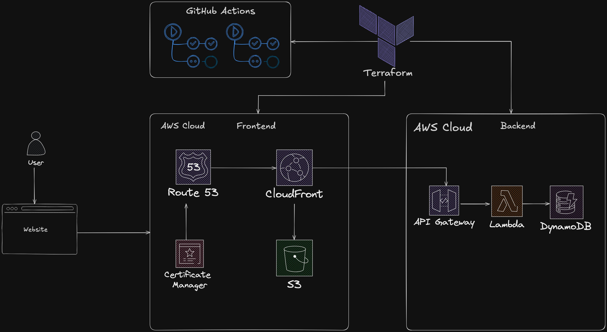

# AWS Cloud Resume Challenge

This repository documents my journey and implementation of the [AWS Cloud Resume Challenge](https://cloudresumechallenge.dev/docs/the-challenge/aws/). This project demonstrates practical skills in building, deploying, and managing a serverless web application on Amazon Web Services, showcasing a personal resume website.

## Architecture Diagram

A visual representation of the project's architecture:

## Technical Implementation

The resume website is built using a combination of AWS services for the frontend, backend (visitor counter), and DNS management.

### Frontend Infrastructure

The frontend consists of static HTML, CSS, and JavaScript files, served globally with low latency and high availability.

#### 1. Amazon S3 (Simple Storage Service)

- **Purpose**: Securely hosts the static website assets (HTML, CSS, JavaScript files).
- **Configuration Highlights**:
  - An S3 bucket was provisioned to store all frontend assets (e.g., `index.html`, `style.css`, `script.js`).
  - **Static website hosting on the S3 bucket itself was intentionally disabled.** Access to the website content is exclusively managed through Amazon CloudFront to enhance security, leverage CDN caching, and enforce HTTPS.

#### 2. Amazon CloudFront

- **Purpose**: Serves as the Content Delivery Network (CDN) to distribute the website globally. This improves load times, enhances security (SSL/TLS termination), and reduces latency for end-users.
- **Configuration Highlights**:
  - **Origin**: The S3 bucket (detailed above) was configured as the origin.
  - **Origin Access**: Implemented **Origin Access Control (OAC)**. This is the AWS-recommended best practice for securely serving private S3 content via CloudFront, ensuring the S3 bucket is not directly publicly accessible.
  - **Viewer Protocol Policy**: Set to **Redirect HTTP to HTTPS**, ensuring all user traffic is encrypted.
  - **AWS WAF (Web Application Firewall)**: WAF was not enabled for this iteration of the project.
  - **Default Root Object**: Configured to `index.html`, ensuring users accessing the root URL are served the main resume page.
  - Other settings were generally maintained at their default values.
- **S3 Bucket Policy Update**: After the CloudFront distribution was created, the S3 bucket policy was updated with the statement provided by CloudFront. This grants the CloudFront distribution the necessary `s3:GetObject` permissions to fetch objects from the S3 bucket.

#### 3. AWS Certificate Manager (ACM)

- **Purpose**: Provisions, manages, and deploys public SSL/TLS certificates to enable HTTPS for the custom domain.
- **Implementation**:
  - A public SSL/TLS certificate was requested via ACM for the custom domain (e.g., `yourname.yourdomain.com`).
  - The certificate was validated (typically through DNS validation by adding CNAME records to the Route 53 hosted zone).
  - _Note: DNS validation can take some time (often around 30 minutes) for the certificate status to change from "Pending validation" to "Issued."_

#### 4. Amazon Route 53

- **Purpose**: Provides a highly available and scalable Domain Name System (DNS) web service. It translates the human-readable custom domain name into the CloudFront distribution's address.
- **Configuration Highlights**:
  - An **Alias record** was created within the domain's hosted zone in Route 53.
  - This Alias record points the custom domain name (e.g., `resume.yourdomain.com`) to the Amazon CloudFront distribution domain name. Using an Alias record is an AWS best practice for routing traffic to AWS resources like CloudFront distributions.

### Backend: Visitor Counter

A serverless backend was implemented to track the number of visitors to the resume website.

#### 1. Amazon DynamoDB (Visitor Counter Storage)

- **Purpose**: To persistently store and manage the website's visitor count.
- **Implementation**:
  - A DynamoDB table named `cloud-resume-challenge-test` was provisioned.
  - The table uses a primary key (e.g., `id` of type String or Number). For this project, a specific item (e.g., with `id` = "1" or "visitor_count_item") is used to store the count.
  - An attribute named `views` (Number) stores the visitor count. This item was initialized with a starting value (e.g., 0 or 1, as per the challenge's initial setup described by the user as `id`=1, `views`=1).
  - The Lambda function has IAM permissions to read and update this specific item in the DynamoDB table.

#### 2. AWS Lambda & Amazon API Gateway (Visitor Counter API)

- **Purpose**: To provide a serverless HTTP API endpoint that, when invoked, increments the visitor count in DynamoDB and returns the updated count.
- **Lambda Function (`cloud-resume-api`)**:
  - Developed using **Python 3.13**.
  - The function's core logic involves:
    - Receiving the request from API Gateway.
    - Interacting with the `cloud-resume-challenge-test` DynamoDB table to atomically increment the `views` attribute for the designated counter item.
    - Returning the updated `views` count in the HTTP response.
  - **IAM Role**: An IAM role was created and assigned to the Lambda function, granting it permissions to:
    - Write logs to Amazon CloudWatch Logs (for monitoring and debugging).
    - Perform `dynamodb:UpdateItem` and `dynamodb:GetItem` actions on the specific `cloud-resume-challenge-test` DynamoDB table resource.
- **Amazon API Gateway**:

  - An HTTP API (or REST API) endpoint was configured in API Gateway.
  - This endpoint is integrated with the `cloud-resume-api` Lambda function, triggering it upon receiving requests (typically a `POST` or `GET` request from the frontend JavaScript).
  - **CORS (Cross-Origin Resource Sharing)**: CORS was enabled and configured on the API Gateway endpoint. This allows requests from the resume website's domain (e.g., `https://resume.yourdomain.com`) to access the API. Without proper CORS configuration, browser security policies would block the frontend JavaScript from calling the API.

### Frontend JavaScript (Visitor Counter Integration)

- **Purpose**: To call the backend API, retrieve the visitor count, and display it on the resume website.
- **Implementation**:
  - A JavaScript file (`script.js` or similar) is included in the `index.html`.
  - This script uses the `fetch` API to make an asynchronous request (e.g., `POST`) to the API Gateway endpoint.
  - Upon receiving a successful response, the script parses the JSON data (containing the count) and updates the content of a designated HTML element (e.g., ``) on the page.
  - Error handling is included to manage potential issues during the API call.

## Technologies Used

- **AWS Services**:
  - Amazon S3 (Static Website Hosting)
  - Amazon CloudFront (CDN)
  - AWS Certificate Manager (ACM for SSL/TLS)
  - Amazon Route 53 (DNS Management)
  - Amazon DynamoDB (NoSQL Database for Visitor Counter)
  - AWS Lambda (Serverless Compute for API Logic)
  - Amazon API Gateway (Exposing Lambda Function as HTTP API)
  - AWS IAM (Identity and Access Management)
  - Amazon CloudWatch (Logging and Monitoring)
- **Frontend**:
  - HTML5
  - CSS3
  - JavaScript (for dynamic visitor counter)
- **Backend (Lambda)**:
  - Python 3.13
- **Version Control**:
  - Git & GitHub

## Accessing the Live Resume

Once the CloudFront distribution was deployed and DNS records in Route 53 propagated:

1.  The website was first tested using the **CloudFront Distribution Domain Name** (e.g., `d12345abcdef.cloudfront.net`) to ensure content delivery.
2.  After DNS propagation, the **custom domain name** (e.g., `https://resume.yourdomain.com`) was accessed to verify the complete setup.

**Live Resume URL**:
