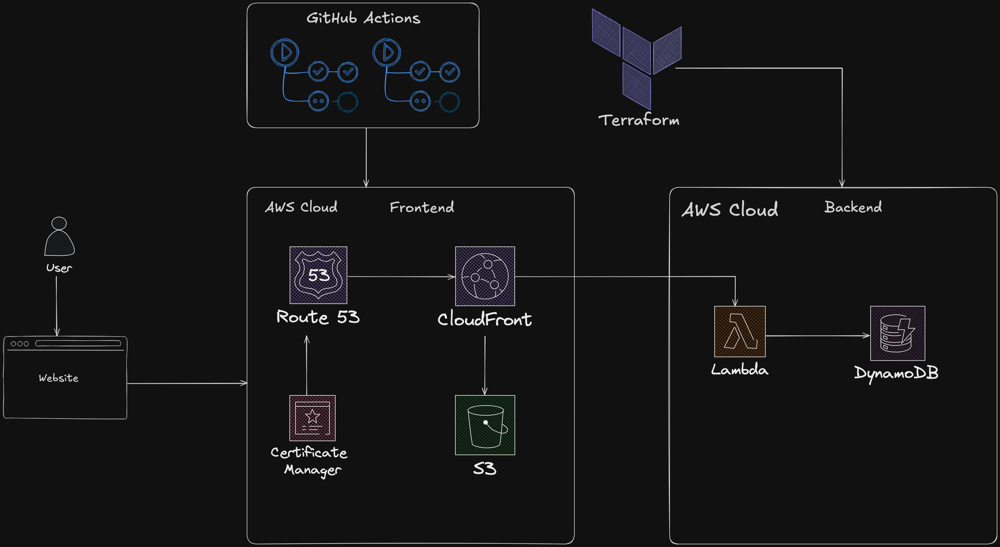

# AWS Cloud Resume Challenge

This repository contains the code and documentation for my attempt at the [AWS Cloud Resume Challenge](https://cloudresumechallenge.dev/docs/the-challenge/aws/). This challenge involves building a personal resume website hosted on AWS, incorporating various cloud services and DevOps practices.

## About The Challenge

The Cloud Resume Challenge is a hands-on project designed to help individuals learn and demonstrate cloud and DevOps skills. The AWS version focuses on utilizing Amazon Web Services to build, deploy, and manage a serverless web application.

## Architecture Diagram

